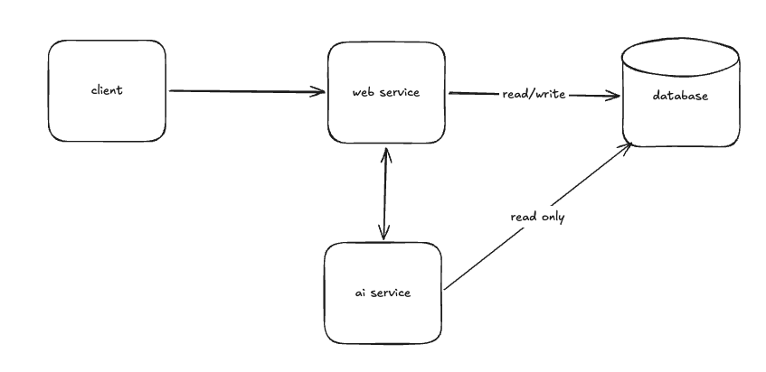
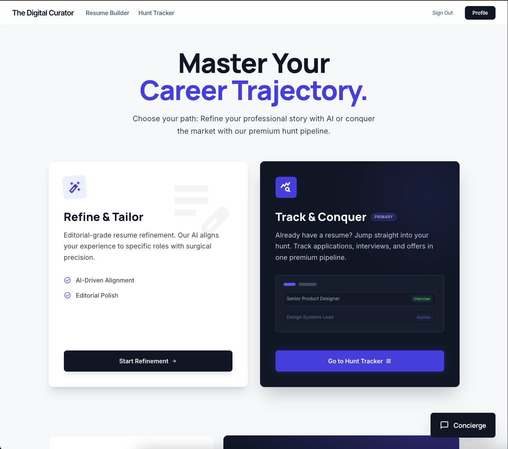
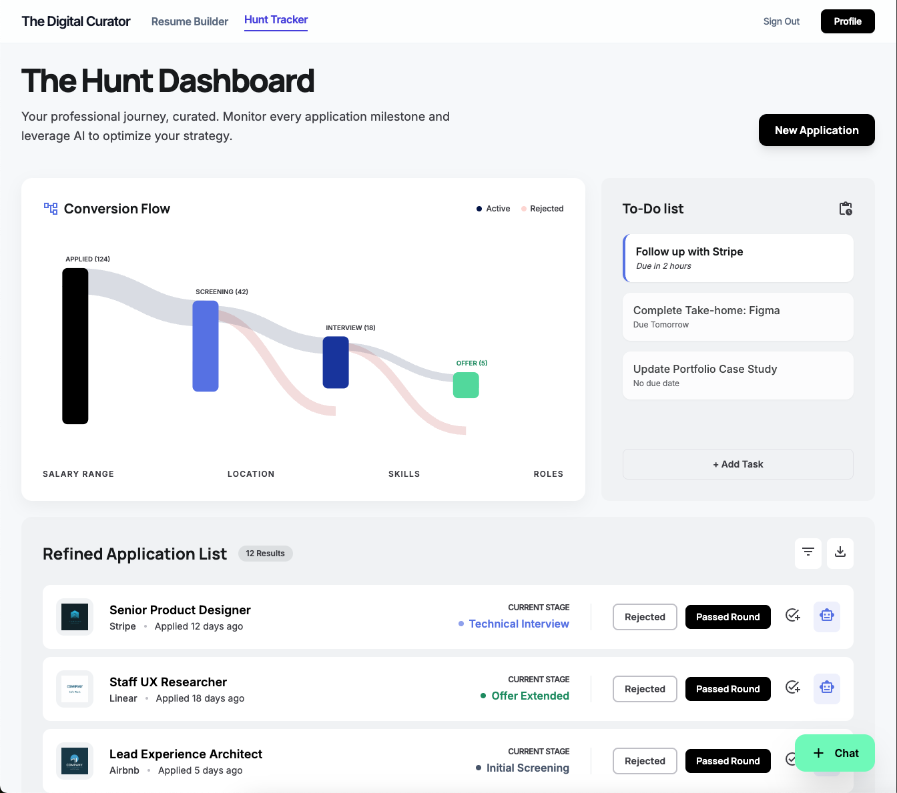
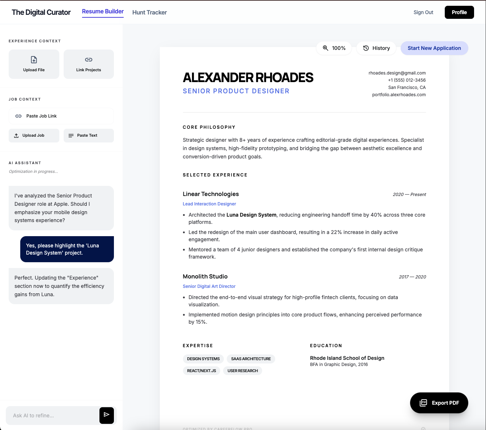
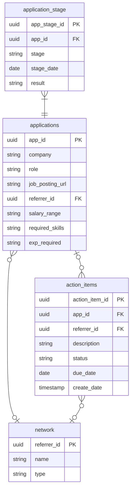

# Your job hunt
A web app to help with creating resumes and tracking job hunts. Both resume creation and job hunt tracking will be agentically augmented.

## Features
There are 2 feature paths: resume tailoring and job hunt tracking.

### Resume tailoring
* Audit resumes for Action-Context-Result (ACR) format and Application-Tracking-System (ATS) optimization
* Convert raw work notes into a resume
* Polish draft resume
* Tailor resume to user provided job listings

### Job hunt tracking
* Allow users to track applications life cycle through natural language
* Allow users to track action items through natural language
* Provide users with a sankey graph for their job hunt

## Project overview



### Tech stack

| Service | Language | Frameworks | Build | Container |
|:--------|:---------|:-----------|:------|:----------|
| Frontend | TypeScript | React, [MUI X](https://mui.com/x/react-charts/), [TanStack Query](https://tanstack.com/query/latest) | Vite | — (Render static site) |
| Web service | Kotlin | [Spring Boot](https://spring.io/projects/spring-boot) | Gradle (Kotlin DSL) | Docker (JDK 21) |
| Agent service | Python | [FastAPI](https://fastapi.tiangolo.com/), [LangGraph](https://langchain-ai.github.io/langgraph/) | uv / pyproject.toml | Docker (Python 3.11) |
| Database | SQL | PostgreSQL | Flyway migrations | Docker |

- **Internal comms:** gRPC (proto contracts in `/proto`)
- **Auth:** Firebase
- **Deployment:** [Render](https://render.com/) — orchestrated via `render.yaml`
- **Version control:** git

### File scaffold
```
your-job-hunt/
├── render.yaml              # Deployment orchestration (DB, services, static site)
├── proto/                   # gRPC service & message definitions
├── database/                # Flyway migrations and optional seed data
├── web-service/             # Spring Boot REST API
├── agent-service/           # FastAPI + LangGraph agent service
└── frontend/                # React SPA
```

### UI mocks
| Home | Hunt Dashboard | Resume Builder |
|:----:|:--------------:|:--------------:|
|  |  |  |

## Development Plan

The app is built in three phases. Each phase ships working, deployed functionality before the next begins.

| Phase | Scope | AI? |
|:------|:------|:----|
| 1 | Job hunt tracking — full-stack CRUD web app | No |
| 2 | AI augmentation for job hunt tracking | Yes |
| 3 | Resume builder | Yes |

**Phase 1** delivers the complete job hunt tracking feature set: applications, stages, action items, and contacts — authenticated via Firebase, persisted in PostgreSQL, deployed on Render. Built in full-stack feature slices (scaffold → landing page → auth → applications → stages → Sankey dashboard → todos → contacts). No AI in this phase. See [Phase 1 Detailed Design](./docs/Phase%201%20Detailed%20Design.md).

**Phase 2** layers AI on top of Phase 1 with no database changes. Adds an `agent-service` (FastAPI + LangGraph) connected to the web service via gRPC. Users interact with their hunt data through natural language — the agent translates intent into REST API calls against existing endpoints. A chat panel (SSE stream) appears in the dashboard via a FAB.

**Phase 3** adds the resume builder: a split-pane UI (AI chat sidebar + live resume canvas) backed by resume-tailoring agents. Adds file upload support (pre-signed URLs) and PDF export. The `your_crew/` CLI prototype informs the agent design.

---

## Design

### Entities


### API Documentation

Key user journeys can be seen in the Features section.

#### Agent Interaction API
| Method | Path | Description | Status Codes |
|:-------|:-----|:------------|:-------------|
| **POST** | `/agents/resume/{sid}/stream` | Real-time SSE stream for interactive resume editing. | `200`, `500` |
| **GET** | `/agents/resume/{sid}/history` | Retrieve past tailored bullet points or advice. | `200`, `404` |
| **POST** | `/agents/hunt/{sid}/invoke` | Non-interactive ai assistance from certain UI elements. | `200`, `202`, `401` |
| **POST** | `/agents/hunt/{sid}/stream` | Interactive chat with hunt tracking ai agent. | `200`, `500` |
| **GET** | `/agents/hunt/{sid}/history` | Fetch previous chat context. | `200`, `404` |
| **DELETE** | `/agents/{sid}` | Clear the "short-term memory" for a specific session. | `204`, `404` |

#### File upload
TBD api for uploading files for resume handling. Could start with uploading files. Would like to use pre-signed urls. Initially can limit users to txt file upload to make things easier. Looking for cloud solution compatible with my render deployment strategy.

```
POST /resume/context
POST /resume/job-listing
```

#### Network
Manage your professional contacts and referrers.

| Method | Path | Description | Status Codes |
|:-------|:-----|:------------|:-------------|
| **POST** | `/network` | Create contact | `201` |
| **GET** | `/network` | List contacts | `200` |
| **GET** | `/network/{referrer_id}` | Get contact | `200` / `404` |
| **PATCH** | `/network/{referrer_id}` | Update contact | `200` / `404` |
| **DELETE** | `/network/{referrer_id}` | Delete contact | `204` / `409 (FK)` |

#### Applications
Track your job applications and their origin.

| Method | Path | Description | Status Codes |
|:-------|:-----|:------------|:-------------|
| **POST** | `/applications` | Create application | `201` / `409 (dup URL)` |
| **GET** | `/applications` | Get all applications | `200` |
| **GET** | `/applications/dashboard` | Applications joined with latest stage — purpose-built for the hunt dashboard | `200` |
| **GET** | `/applications/{app_id}` | Get application (typically used in conjunction with GET /applications/{app_id}/stages)| `200` / `404` |
| **PATCH** | `/applications/{app_id}` | Update fields | `200` / `404` |
| **DELETE** | `/applications/{app_id}` | Delete | `204` / `409 (FK)` |

#### Application Stages
Manage the specific timeline (Referrals, Interviews, OA, Offers) for an application.

| Method | Path | Description | Status Codes |
|:-------|:-----|:------------|:-------------|
| **POST** | `/applications/{app_id}/stages` | Add stage | `201` / `404` |
| **GET** | `/applications/{app_id}/stages` | List stages | `200` |
| **GET** | `/applications/{app_id}/stages/{stage_id}` | Get stage | `200` / `404` |
| **PATCH** | `/applications/{app_id}/stages/{stage_id}` | Update stage | `200` / `404` |
| **DELETE** | `/applications/{app_id}/stages/{stage_id}` | Delete stage | `204` / `404` |

#### Action Items
Follow-up tasks and networking "to-dos."

| Method | Path | Description | Status Codes |
|:-------|:-----|:------------|:-------------|
| **POST** | `/action-items` | Create item | `201` |
| **GET** | `/action-items` | List (filters: `app_id`, `referrer_id`, `status`) | `200` |
| **GET** | `/action-items/{action_item_id}` | Get item | `200` / `404` |
| **PATCH** | `/action-items/{action_item_id}` | Update item | `200` / `404` |
| **DELETE** | `/action-items/{action_item_id}` | Delete item | `204` / `404` |
