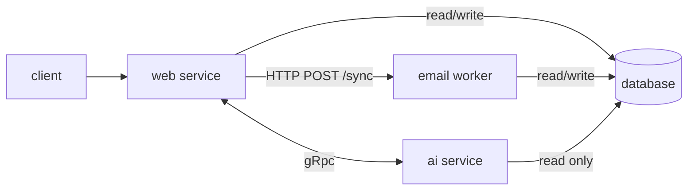
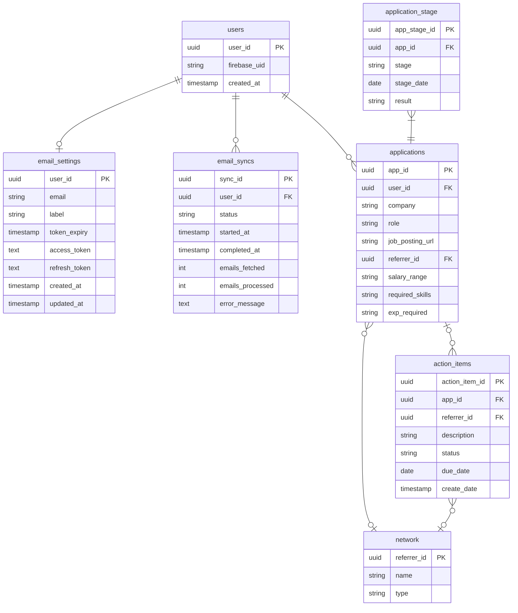

# Your job hunt
A web app to help with creating resumes and tracking job hunts. Both resume creation and job hunt tracking will be agentically augmented.

## Features
There are 2 feature paths: resume tailoring and job hunt tracking.

### Resume tailoring
* Audit resumes for Action-Context-Result (ACR) format and Application-Tracking-System (ATS) optimization
* Convert raw work notes into a resume
* Polish draft resume
* Tailor resume to user provided job listings

### Job hunt tracking
* Allow users to track applications life cycle through natural language
* Allow users to track action items through natural language
* Provide users with a sankey graph for their job hunt

### UI mocks
| Home | Hunt Dashboard | Resume Builder |
|:----:|:--------------:|:--------------:|
|  |  |  |

## Project overview



### Tech stack

| Service | Language | Frameworks | Build | Container |
|:--------|:---------|:-----------|:------|:----------|
| Frontend | TypeScript | React, [MUI X](https://mui.com/x/react-charts/), [TanStack Query](https://tanstack.com/query/latest) | Vite | — (Render static site) |
| Web service | Kotlin | [Spring Boot](https://spring.io/projects/spring-boot) | Gradle (Kotlin DSL) | Docker (JDK 21) |
| Agent service | Python | [grpcio](https://grpc.io/docs/languages/python/), [LangGraph](https://langchain-ai.github.io/langgraph/) | uv / pyproject.toml | Docker (Python 3.12) |
| Email worker | Python | FastAPI, LangChain, psycopg2 | uv / pyproject.toml | Docker (Python 3.12) |
| Database | SQL | PostgreSQL | Flyway migrations | Docker |

- **Internal comms:** gRPC (proto contracts in `/proto`) — web service is gRPC client, agent service is gRPC server
- **Auth:** Firebase
- **Deployment:** [Render](https://render.com/) — orchestrated via `render.yaml`
- **Version control:** git

### File scaffold
```
your-job-hunt/
├── render.yaml              # Deployment orchestration (DB, services, static site)
├── proto/                   # gRPC service & message definitions
├── database/                # Flyway migrations and optional seed data
├── web-service/             # Spring Boot REST API
├── agent-service/           # gRPC server — AI agents (internal only)
├── email-worker/            # FastAPI private service — Gmail sync worker
└── frontend/                # React SPA
```

## Development Plan

The app is built in three phases. Each phase ships working, deployed functionality before the next begins.

| Phase | Scope | AI? |
|:------|:------|:----|
| 1 | Job hunt tracking — full-stack CRUD web app | No |
| 2 | AI augmentation for job hunt tracking | Yes |
| 3 | Resume builder | Yes |

**Phase 1** delivers the complete job hunt tracking feature set: applications, stages, action items, and contacts — authenticated via Firebase, persisted in PostgreSQL, deployed on Render. Built in full-stack feature slices (scaffold → landing page → auth → applications → stages → Sankey dashboard → todos → contacts). No AI in this phase. See [Phase 1 Detailed Design](./docs/Phase%201%20Detailed%20Design.md).

**Phase 2** layers AI on top of Phase 1 with no database changes. Adds an `agent-service` (FastAPI + LangGraph) connected to the web service via gRPC. Users interact with their hunt data through natural language — the agent translates intent into REST API calls against existing endpoints. A chat panel (SSE stream) appears in the dashboard via a FAB.

**Phase 3** adds the resume builder: a split-pane UI (AI chat sidebar + live resume canvas) backed by resume-tailoring agents. Adds file upload support (pre-signed URLs) and PDF export. The `your_crew/` CLI prototype informs the agent design.

---

## Local Development

### Prerequisites
- [Docker Desktop](https://www.docker.com/products/docker-desktop/)
- JDK 21 — see [web-service/README.md](./web-service/README.md)
- [Node.js 20+](https://nodejs.org/)
- [Python 3.12+](https://www.python.org/) and [uv](https://docs.astral.sh/uv/)
- Firebase project configured — see [docs/Firebase Playbook.md](./docs/Firebase%20Playbook.md)

### 1. Start PostgreSQL
```bash
docker compose up -d db
```

### 2. Run the web service
Set the Firebase service account credential, then start the service:
```bash
export FIREBASE_SERVICE_ACCOUNT=$(cat /path/to/service-account.json)
cd web-service
./gradlew bootRun
```
The API will be available at `http://localhost:8080`.

### 3. Run the agent service
In a separate terminal:
```bash
cd agent-service
uv sync --extra dev
# Generate gRPC stubs (re-run whenever proto/agent_service.proto changes)
uv run python -m grpc_tools.protoc -I../proto --python_out=. --grpc_python_out=. ../proto/agent_service.proto
uv run main.py
```
The agent service listens on `:50051` (internal gRPC, not HTTP).

### 4. Run the frontend
In a separate terminal:
```bash
cd frontend
npm install   # first time only
npm run dev
```
The app will be available at `http://localhost:5173`.

### 5. Run the email worker
In a separate terminal (requires `GEMINI_API_KEY` and DB env vars in `email-worker/.env.local`):
```bash
cd email-worker
uv sync --extra dev   # first time only
uv run uvicorn main:app --port 8001 --reload
```
Also set `EMAIL_WORKER_URL=http://localhost:8001` in `web-service/.env.local` so the web service can reach it.

### Verify
```bash
curl http://localhost:8080/health
# → {"status":"ok"}
curl http://localhost:8001/health
# → {"status":"ok"}
```

### Run tests
```bash
# Backend unit tests
cd web-service && ./gradlew test

# Agent service tests
cd agent-service && uv run pytest

# Email worker tests
cd email-worker && uv run pytest

# Frontend unit tests
cd frontend && npm test
```

### Stop
```bash
docker compose down
```

---

## Deployment Setup

The app is deployed on [Render](https://render.com/) using the `render.yaml` blueprint, connected to the GitHub repo [kaikaikoala/your-job-hunt](https://github.com/kaikaikoala/your-job-hunt). Render auto-deploys on push to `main`.

| Service | URL |
|:--------|:----|
| Web service (API) | https://api.your-job-hunt.com |
| Agent service | Internal only (Render private network, port 50051) |
| Email worker | Internal only (Render private network, port 8001) |
| Frontend | https://your-job-hunt.com |

### Health check
```bash
curl https://api.your-job-hunt.com/health
# → {"status":"ok"}
```

### Services
The `render.yaml` blueprint provisions:

- **`jobhunt-db`** — PostgreSQL (free tier)
- **`jobhunt-api`** — Docker web service (Spring Boot); DB connection env vars are injected automatically from the database
- **`jobhunt-agent`** — Docker private service (gRPC, port 50051); hosts all AI agents; accessible only from within Render's private network
- **`jobhunt-email-worker`** — Docker private service (HTTP, port 8001); Gmail sync worker; accessible only from within Render's private network
- **`jobhunt-frontend`** — Static site built with `npm run build` from `./frontend`; `VITE_API_URL` points to the deployed web service

### Environment variables

Variables are set **per service** in the Render dashboard (or via `render.yaml`). `sync: false` means the value must be entered manually in the dashboard — it is never committed to the repo.

**Web service (`jobhunt-api`)**

| Variable | Source | Notes |
|:---------|:-------|:------|
| `DB_HOST` | Auto-injected from `jobhunt-db` | |
| `DB_PORT` | Auto-injected from `jobhunt-db` | |
| `DB_NAME` | Auto-injected from `jobhunt-db` | |
| `DB_USER` | Auto-injected from `jobhunt-db` | |
| `DB_PASSWORD` | Auto-injected from `jobhunt-db` | |
| `FIREBASE_SERVICE_ACCOUNT` | Manual (`sync: false`) | Paste the contents of your Firebase service account JSON |

**Web service (`jobhunt-api`) — additional**

| Variable | Source | Notes |
|:---------|:-------|:------|
| `AGENT_GRPC_HOST` | Set in `render.yaml` | Render private network hostname of the agent service (`jobhunt-agent`) |
| `EMAIL_WORKER_URL` | Set in `render.yaml` | Render private network URL for the email worker (`http://jobhunt-email-worker:8001`) |
| `GMAIL_CLIENT_ID` | Manual (`sync: false`) | Google OAuth client ID |
| `GMAIL_CLIENT_SECRET` | Manual (`sync: false`) | Google OAuth client secret |
| `TOKEN_ENCRYPTION_KEY` | Manual (`sync: false`) | 32-byte random key, base64url-encoded; used for AES-256-GCM token encryption |

**Agent service (`jobhunt-agent`)**

| Variable | Source | Notes |
|:---------|:-------|:------|
| `ANTHROPIC_API_KEY` | Manual (`sync: false`) | Required from Sub-task 2 onward |

**Email worker (`jobhunt-email-worker`)**

| Variable | Source | Notes |
|:---------|:-------|:------|
| `DB_HOST` | Auto-injected from `jobhunt-db` | |
| `DB_PORT` | Auto-injected from `jobhunt-db` | |
| `DB_NAME` | Auto-injected from `jobhunt-db` | |
| `DB_USER` | Auto-injected from `jobhunt-db` | |
| `DB_PASSWORD` | Auto-injected from `jobhunt-db` | |
| `GEMINI_API_KEY` | Manual (`sync: false`) | Gemini API key for LangChain filter and orchestrator agents |

**Frontend (`jobhunt-frontend`)**

| Variable | Source | Notes |
|:---------|:-------|:------|
| `VITE_API_URL` | Set in `render.yaml` | Points to the deployed web service URL |
| `VITE_FIREBASE_API_KEY` | Manual (`sync: false`) | |
| `VITE_FIREBASE_AUTH_DOMAIN` | Manual (`sync: false`) | |
| `VITE_FIREBASE_PROJECT_ID` | Manual (`sync: false`) | |
| `VITE_FIREBASE_APP_ID` | Manual (`sync: false`) | |
| `VITE_GMAIL_CLIENT_ID` | Manual (`sync: false`) | Google OAuth client ID (same value as `GMAIL_CLIENT_ID`) |

### Firebase configuration

See [docs/Firebase Playbook.md](./docs/Firebase%20Playbook.md) for authorized domain and secret setup.

### Re-deploying
Push to `main` on GitHub. Render picks up the change automatically. To trigger a manual deploy, use the Render dashboard or the Render CLI.

---

## Design

### Entities


### API Documentation

Key user journeys can be seen in the Features section.

#### Agent Interaction API
| Method | Path | Description | Status Codes |
|:-------|:-----|:------------|:-------------|
| **POST** | `/agents/resume/{sid}/stream` | Real-time SSE stream for interactive resume editing. | `200`, `500` |
| **GET** | `/agents/resume/{sid}/history` | Retrieve past tailored bullet points or advice. | `200`, `404` |
| **POST** | `/agents/hunt/{sid}/invoke` | Non-interactive ai assistance from certain UI elements. | `200`, `202`, `401` |
| **POST** | `/agents/hunt/{sid}/stream` | Interactive chat with hunt tracking ai agent. | `200`, `500` |
| **GET** | `/agents/hunt/{sid}/history` | Fetch previous chat context. | `200`, `404` |
| **DELETE** | `/agents/{sid}` | Clear the "short-term memory" for a specific session. | `204`, `404` |

#### File upload
TBD api for uploading files for resume handling. Could start with uploading files. Would like to use pre-signed urls. Initially can limit users to txt file upload to make things easier. Looking for cloud solution compatible with my render deployment strategy.

```
POST /resume/context
POST /resume/job-listing
```

#### Network
Manage your professional contacts and referrers.

| Method | Path | Description | Status Codes |
|:-------|:-----|:------------|:-------------|
| **POST** | `/network` | Create contact | `201` |
| **GET** | `/network` | List contacts | `200` |
| **GET** | `/network/{referrer_id}` | Get contact | `200` / `404` |
| **PATCH** | `/network/{referrer_id}` | Update contact | `200` / `404` |
| **DELETE** | `/network/{referrer_id}` | Delete contact | `204` / `409 (FK)` |

#### Applications
Track your job applications and their origin.

| Method | Path | Description | Status Codes |
|:-------|:-----|:------------|:-------------|
| **POST** | `/applications` | Create application | `201` / `409 (dup URL)` |
| **GET** | `/applications` | Get all applications | `200` |
| **GET** | `/applications/dashboard` | Applications joined with latest stage — purpose-built for the hunt dashboard | `200` |
| **GET** | `/applications/{app_id}` | Get application (typically used in conjunction with GET /applications/{app_id}/stages)| `200` / `404` |
| **PATCH** | `/applications/{app_id}` | Update fields | `200` / `404` |
| **DELETE** | `/applications/{app_id}` | Delete | `204` / `409 (FK)` |

#### Application Stages
Manage the specific timeline (Referrals, Interviews, OA, Offers) for an application.

| Method | Path | Description | Status Codes |
|:-------|:-----|:------------|:-------------|
| **POST** | `/applications/{app_id}/stages` | Add stage | `201` / `404` |
| **GET** | `/applications/{app_id}/stages` | List stages | `200` |
| **GET** | `/applications/{app_id}/stages/{stage_id}` | Get stage | `200` / `404` |
| **PATCH** | `/applications/{app_id}/stages/{stage_id}` | Update stage | `200` / `404` |
| **DELETE** | `/applications/{app_id}/stages/{stage_id}` | Delete stage | `204` / `404` |

#### Action Items
Follow-up tasks and networking "to-dos."

| Method | Path | Description | Status Codes |
|:-------|:-----|:------------|:-------------|
| **POST** | `/action-items` | Create item | `201` |
| **GET** | `/action-items` | List (filters: `app_id`, `referrer_id`, `status`) | `200` |
| **GET** | `/action-items/{action_item_id}` | Get item | `200` / `404` |
| **PATCH** | `/action-items/{action_item_id}` | Update item | `200` / `404` |
| **DELETE** | `/action-items/{action_item_id}` | Delete item | `204` / `404` |

#### Email Settings
Gmail OAuth connect flow — stores encrypted tokens per user.

| Method | Path | Description | Status Codes |
|:-------|:-----|:------------|:-------------|
| **GET** | `/email-settings` | Get linked Gmail account `{email, label}` | `200` / `404` |
| **POST** | `/email-settings` | Exchange OAuth code for tokens; save encrypted | `201` / `409` |
| **PATCH** | `/email-settings` | Update label | `200` / `404` |
| **DELETE** | `/email-settings` | Revoke token at Google and delete row | `204` / `404` |

#### Email Sync
Trigger and monitor Gmail email sync operations. The worker fetches emails, filters with an LLM, and creates applications directly in PostgreSQL.

| Method | Path | Description | Status Codes |
|:-------|:-----|:------------|:-------------|
| **POST** | `/email-syncs` | Start a Gmail sync; returns `{syncId}` immediately | `202` / `404 (no settings)` / `409 (sync running)` |
| **GET** | `/email-syncs` | List all syncs for the user (most recent first) | `200` |
| **GET** | `/email-syncs/{sync_id}` | Poll sync status | `200` / `404` |
