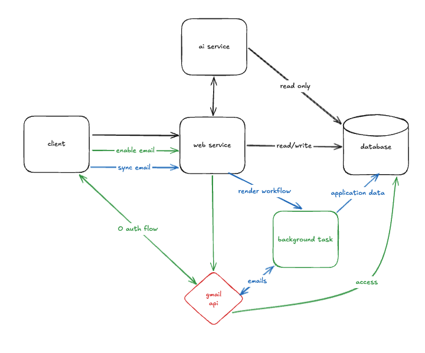
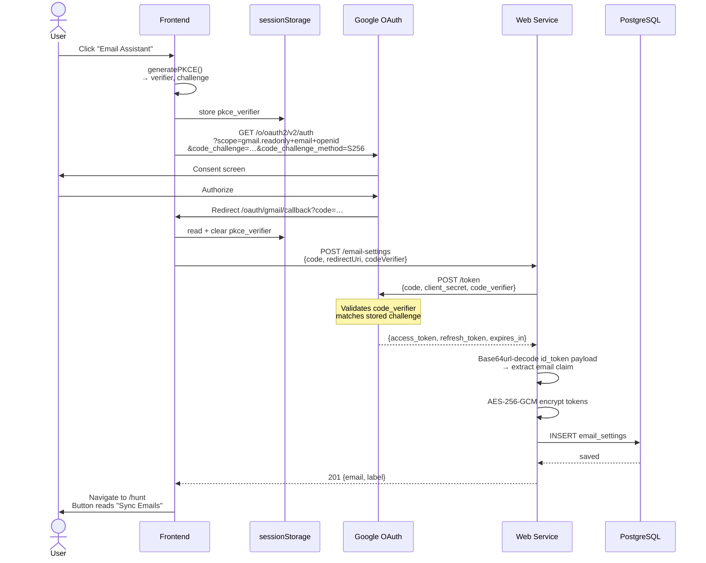

# Gmail Integration

> Claude plan: `/Users/bubbletian/.claude/plans/valiant-zooming-bonbon.md`

A Gmail-powered background worker that automatically parses job-related emails and populates/updates the user's applications, stages, and action items — reducing manual data entry.

## System diagram


## OAuth connect flow (PKCE)



---

## Architecture decisions

- **email-worker writes directly to PostgreSQL** via psycopg2 — no web-service HTTP calls needed, no service-to-service auth complexity
- **Per-user sync lock** enforced by a partial unique index on `email_syncs (user_id) WHERE status = 'running'` — the DB rejects a second concurrent sync at the constraint level
- **web-service owns sync initiation** — `POST /email-syncs` creates the row and fires off the worker via Render's private network; returns `202 {sync_id}` for the frontend to poll
- **email-worker is a FastAPI private service** on Render, not publicly reachable; communication with web-service is via internal hostname only

---

## Database schema

### `email_settings`
```sql
CREATE TABLE email_settings (
    user_id VARCHAR(128) PRIMARY KEY,
    email VARCHAR(255) NOT NULL,
    label VARCHAR(255),
    token_expiry TIMESTAMP,
    access_token TEXT NOT NULL,
    refresh_token TEXT NOT NULL,
    created_at TIMESTAMP DEFAULT NOW(),
    updated_at TIMESTAMP DEFAULT NOW()
);
```

### `email_syncs`
```sql
CREATE TABLE email_syncs (
    sync_id UUID PRIMARY KEY,
    user_id VARCHAR(128) NOT NULL REFERENCES email_settings(user_id) ON DELETE CASCADE,
    status VARCHAR(20) NOT NULL DEFAULT 'running',  -- running | completed | failed
    started_at TIMESTAMP NOT NULL DEFAULT NOW(),
    completed_at TIMESTAMP,
    emails_fetched INT,
    emails_processed INT,
    error_message TEXT
);

-- Enforces one running sync per user at the DB level
CREATE UNIQUE INDEX one_running_sync_per_user
ON email_syncs (user_id)
WHERE status = 'running';
```

---

## New API endpoints

### email-settings

| Method | Path | Description | Status Codes |
|--------|------|-------------|--------------|
| `GET` | `/email-settings` | Get `{email, label}` — no tokens | `200`, `404` |
| `POST` | `/email-settings` | Exchange OAuth code → store tokens | `201`, `409` |
| `PATCH` | `/email-settings` | Update `label` | `200`, `404` |
| `DELETE` | `/email-settings` | Revoke + delete | `204`, `404` |

### email-syncs

| Method | Path | Description | Status Codes |
|--------|------|-------------|--------------|
| `POST` | `/email-syncs` | Trigger sync job | `202 {sync_id}`, `409 already running` |
| `GET` | `/email-syncs` | List recent syncs | `200` |
| `GET` | `/email-syncs/{sync_id}` | Poll sync status | `200`, `404` |

---

## email-worker file structure
```
email-worker/
├── Dockerfile
├── pyproject.toml          # langchain, langchain-google-genai, google-api-python-client,
│                           # google-auth-oauthlib, python-dotenv, fastapi, uvicorn, psycopg2-binary
├── main.py                 # FastAPI app — POST /sync entry point
├── gmail_client.py         # Gmail API wrapper: fetch latest 100 emails filtered by label
├── db.py                   # psycopg2 connection pool shared across all tools
├── chains/
│   ├── __init__.py
│   ├── filter_agent.py     # LLM chain: is this email job-related?
│   ├── orchestrator_agent.py  # LLM chain: which tool(s) to apply?
│   └── tools.py            # DB write tools: add_application, add_stage, update_stage, add_action_item
└── config.py               # env vars: DB_*, GEMINI_API_KEY
```

---

## Development phases

### Phase 1 — Enable email parsing ✅
- [x] `database/migrations/V8__create_email_settings.sql`
- [x] `database/migrations/V9__create_email_syncs.sql`
- [x] `web-service`: `EmailSettingsController.kt` + entity/repo (`GET`, `POST`, `PATCH`, `DELETE /email-settings`)
- [x] `frontend`: "Email Assistant" / "Sync Emails" toggle button in `HuntPage.tsx`
- [x] `frontend`: `/oauth/gmail/callback` route — receives `?code=` and calls `POST /email-settings`
- [x] `frontend/src/api/emailSettings.ts`
- [x] `render.yaml`: add `GMAIL_CLIENT_ID`, `GMAIL_CLIENT_SECRET`, `TOKEN_ENCRYPTION_KEY` (web-service); `VITE_GMAIL_CLIENT_ID` (frontend)
- [x] `README.md`: document new endpoints + env vars
- [x] PKCE (`code_challenge`/`code_verifier`) added to OAuth flow

**Verify:** DB tables exist → OAuth flow inserts row → `GET /email-settings` returns `{email, label}` → button toggles correctly in UI ✅ (verified in prod)

### Phase 2 — Add applications from emails ✅
- [x] Scaffold `email-worker/` (Dockerfile, pyproject.toml, main.py, gmail_client.py, db.py, config.py)
- [x] `chains/filter_agent.py` — LLM filter: is this email job-related?
- [x] `chains/orchestrator_agent.py` — LLM router: which tools to call?
- [x] `chains/tools.py` — `add_application` tool (direct DB write)
- [x] `web-service`: `EmailSync.kt` entity + `EmailSyncRepository.kt` + `EmailSyncController.kt` (`POST`, `GET /email-syncs`, `GET /email-syncs/{sync_id}`)
- [x] `web-service`: `EmailSyncControllerTest.kt` — 11 tests
- [x] `email-worker/tests/` — 11 pytest tests (filter agent, tools, main endpoint)
- [x] `render.yaml`: add `jobhunt-email-worker` private service with DB env vars + `EMAIL_WORKER_URL` in `jobhunt-api`
- [x] `README.md`: updated diagram, tech stack, file scaffold, local dev, deployment, env vars, API docs, ERD
- [x] `email-worker/README.md`: full rewrite

**Verify:** `POST /email-syncs` → worker triggered → applications created in DB from matching emails

### Phase 3 & 4 — Application stages (add + update)
- [ ] `chains/tools.py`: `add_application_stage` tool
  - Stage types: Applied (receipt email), Pending (Next Steps), Rejected (terminal rejection)
- [ ] `chains/tools.py`: `update_application_stage` tool
  - Confirmation emails → add date; Next Steps pass → result=Passed; rejections → result=Failed
- [ ] Extend orchestrator to route to stage tools

**Verify:** Sync → stages created and updated correctly for known email patterns

### Phase 5 — Action items from emails
- [ ] `chains/tools.py`: `add_action_item` tool
  - Detect scheduling/confirmation emails asking for availability or attendance confirmation

**Verify:** Sync → action items created for matching emails

### Phase 6 — Email settings page
- [ ] New frontend route `/settings/email`
- [ ] Show connected email, editable label field (`PATCH /email-settings`), disconnect button (`DELETE /email-settings`)

---

## Environment variables

### web-service additions
| Variable | Source |
|----------|--------|
| `GMAIL_CLIENT_ID` | Manual (`sync: false`) |
| `GMAIL_CLIENT_SECRET` | Manual (`sync: false`) |

### frontend additions
| Variable | Source |
|----------|--------|
| `VITE_GMAIL_CLIENT_ID` | Set in `render.yaml` |

### email-worker
| Variable | Source |
|----------|--------|
| `GEMINI_API_KEY` | Manual (`sync: false`) |
| `DB_HOST` | Auto-injected from `jobhunt-db` |
| `DB_PORT` | Auto-injected from `jobhunt-db` |
| `DB_NAME` | Auto-injected from `jobhunt-db` |
| `DB_USER` | Auto-injected from `jobhunt-db` |
| `DB_PASSWORD` | Auto-injected from `jobhunt-db` |
