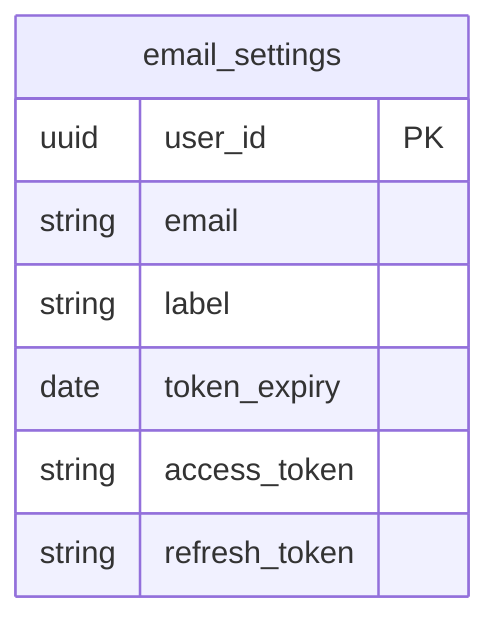

# Email worker

This background worker pulls from the users gmail to find job application data. Then a LangChain will process the emails and add relevant information to the users database.

## System diagram
The color'd portion is what's relevant to this feature.

## ERD

We need to store new data for the users email parser settings

## Email worker

1. Querry gmail api for latest 100 relevant emails
2. Feed emails into a LangChain
  3. Use a filter agent to decide if the email is relevant
  4. Use another agent to understand which tools to be applied
  5. Tool agents: add application, add action item, add application stage, update application stage
1. Call the web-service to update the data base

### Add application
Example email subject: 
* Thanks for applying to Loancrate
* Your application to Synapse Health has been received

In the body of the email we should look for:
* Company name
* Role
* Salary range

### Add action item
Example email subject:
* Next Steps with Render
* Confirming your Interview with Bikky

In the body of the email we should look for:
* Please "replay-all" to confirm your attendance
* please share your availability over the next two weeks

For these types of emails we should find the relenvant user application, and add an action item.

### Add application stage
Example email subject: 
1. Thanks for applying to Loancrate
2. Next Steps with Render 
3. Update from Bikky
4. GitHub Application Follow Up

For 1 we should find the application we would have created earlier in the LangChain, and then we should also create the application_stage applied.

For 2 we should find out what the Next Steps are (Hiring Manager/Lead Screen) then add that application stage with status as pending.

For 3,4 sometimes this is a terminal state where we should add the application_stage Rejected

### Update application stage
Example email subject:
1. Update from Bikky
2. Confirmation: Render Hiring Manager Interview
3. Next Steps with Render 
4. GitHub Application Follow Up

For 1,4 if the terminal state is reached and there was an application rejections then we should update the previous stage as result Failed.

For 2 we should update the application_stage with the date

For 3 this indicates we passed a round so we should update the result as Passed.

## New API's
* GET email-settings/ should only return the users email and label none of the private gmail api access tokens
* POST email-settings/ should trigger the gmail oauth flow which will add a row
* UDPATE email-settings/ when the credentials need to be refreshed
* DELETE email-settings/ if the user want to revoke the email access

* POST sync-emails/ should trigger the background worker

## Development Plan

1. Enable email parsing 
2. Add applications
3. Add application_stage
4. Update application_stage
5. Add action items
6. Add email settings page where user can configure what is a relevant email

### Enable email parsing
New api endpoints:
* GET email-settings/ should only return the users email and label none of the private gmail api access tokens
* POST email-settings/ should trigger the gmail oauth flow which will add a row

Frontend change: 
* in the HuntPage.tsx header we should add a new "Email Assistant" Button next to the "New Application" Button. If the get email settings returns nothing for the user then the button should be to enable

Web service change
* We should call the GMAIL api to enable the user settings and update the db

We should update the root README with the api changes and the new development and deployment information/verification.

### Add applications
In the frontend if the email-settings/ is not null then the "Email Assistant" button should read "Sync Emails".

We need to add a new background wroker to our render.yaml: see https://render.com/docs/workflows. This background worker is email-worker to be put in this directory. This will be a python service.

We need to add the sdk call from web-service to email-worker.

We need to add to email-worker calls to the gmail api.

We should add 3 parts of our LangChain filter agent, orchestrator agent, tool agent.

### Other stages
We should one by one add each new tool to the LangChain.
